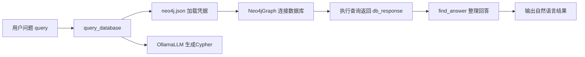

```mermaid
flowchart LR
    A[用户问题 query] --> B[query_database]
    B --> C[neo4j.json 加载凭据]
    C --> D[Neo4jGraph 连接数据库]
    B --> E[OllamaLLM 生成Cypher]
    D --> F[执行查询返回 db_response]
    F --> G[find_answer 整理回答]
    G --> H[输出自然语言结果]
```
