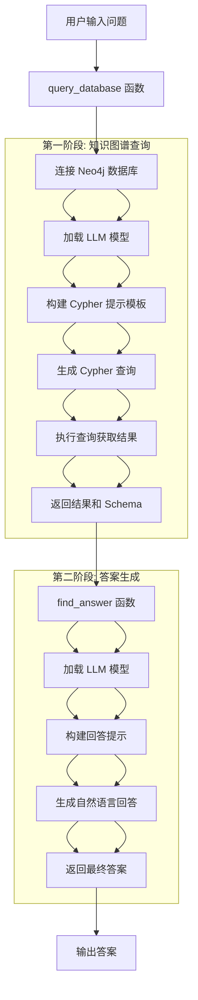

```mermaid
graph TD
A[用户输入问题] --> B[query_database 函数]
B --> C[连接 Neo4j 数据库]
C --> D[加载 LLM 模型]
D --> E[构建 Cypher 提示模板]
E --> F[生成 Cypher 查询]
F --> G[执行查询获取结果]
G --> H[返回结果和 Schema]
H --> I[find_answer 函数]
I --> J[加载 LLM 模型]
J --> K[构建回答提示]
K --> L[生成自然语言回答]
L --> M[返回最终答案]
M --> N[输出答案]

    subgraph 第一阶段: 知识图谱查询
    C --> D --> E --> F --> G --> H
    end

    subgraph 第二阶段: 答案生成
    I --> J --> K --> L --> M
    end

```
