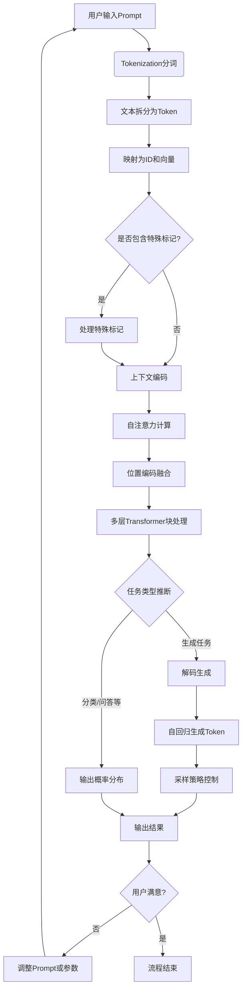

```mermaid
flowchart TD
    A[用户输入Prompt] --> B(Tokenization分词)
    B --> B1[文本拆分为Token]
    B1 --> B2[映射为ID和向量]
    B2 --> C{是否包含特殊标记?}
    C -- 是 --> C1[处理特殊标记]
    C -- 否 --> D[上下文编码]
    C1 --> D
    D --> D1[自注意力计算]
    D1 --> D2[位置编码融合]
    D2 --> E[多层Transformer块处理]
    E --> F{任务类型推断}
    F -- 生成任务 --> G[解码生成]
    F -- 分类/问答等 --> H[输出概率分布]
    G --> G1[自回归生成Token]
    G1 --> G2[采样策略控制]
    G2 --> I[输出结果]
    H --> I
    I --> J{用户满意?}
    J -- 否 --> K[调整Prompt或参数]
    J -- 是 --> L[流程结束]
    K --> A
```
