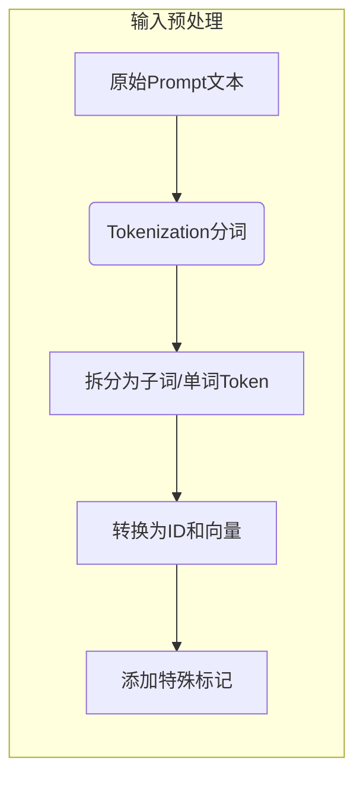

```mermaid
flowchart LR
    subgraph Input_Preprocessing["输入预处理"]
        A[原始Prompt文本] --> B(Tokenization分词)
        B --> B1[拆分为子词/单词Token]
        B1 --> B2[转换为ID和向量]
        B2 --> C[添加特殊标记]
    end
```
