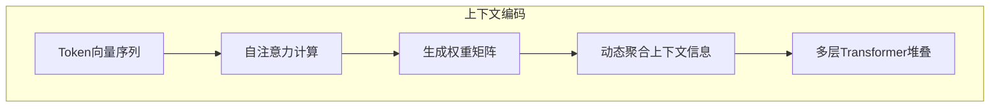

```mermaid
flowchart TD
    subgraph Context_Encoding["上下文编码"]
        D[Token向量序列] --> D1[自注意力计算]
        D1 --> D2[生成权重矩阵]
        D2 --> D3[动态聚合上下文信息]
        D3 --> E[多层Transformer堆叠]
    end
```
