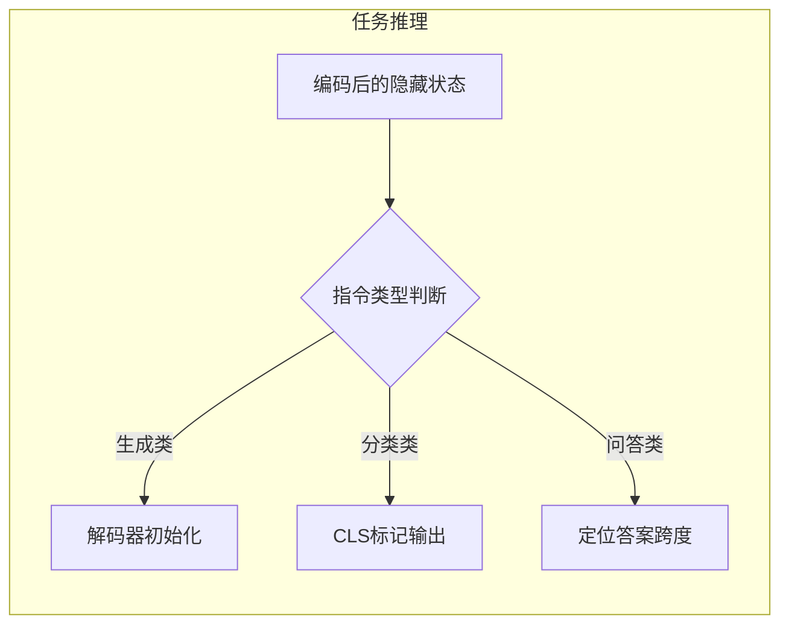

```mermaid
flowchart LR
    subgraph Task_Reasoning["任务推理"]
        F[编码后的隐藏状态] --> F1{指令类型判断}
        F1 -- 生成类 --> G[解码器初始化]
        F1 -- 分类类 --> H[CLS标记输出]
        F1 -- 问答类 --> I[定位答案跨度]
    end
```
