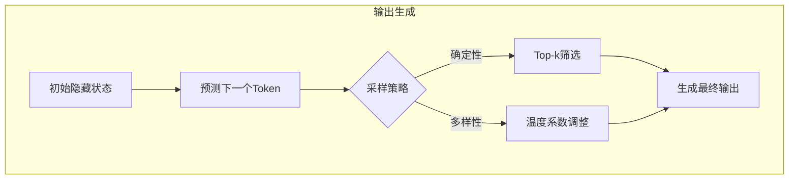

```mermaid
flowchart TD
    subgraph Output_Generation["输出生成"]
        J[初始隐藏状态] --> J1[预测下一个Token]
        J1 --> J2{采样策略}
        J2 -- 确定性 --> K1[Top-k筛选]
        J2 -- 多样性 --> K2[温度系数调整]
        K1 --> L[生成最终输出]
        K2 --> L[生成最终输出]
    end
```
