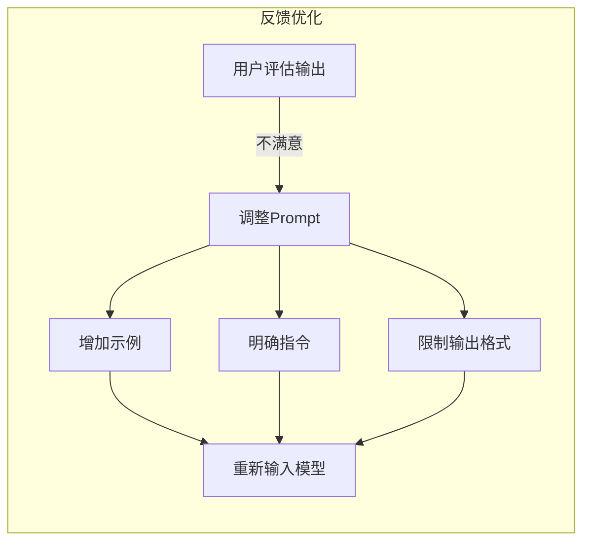

```mermaid
flowchart LR
    subgraph Feedback_Loop["反馈优化"]
        M[用户评估输出] -- 不满意 --> N[调整Prompt]
        N --> N1[增加示例]
        N --> N2[明确指令]
        N --> N3[限制输出格式]
        N1 --> O[重新输入模型]
        N2 --> O[重新输入模型]
        N3 --> O[重新输入模型]
    end
```
